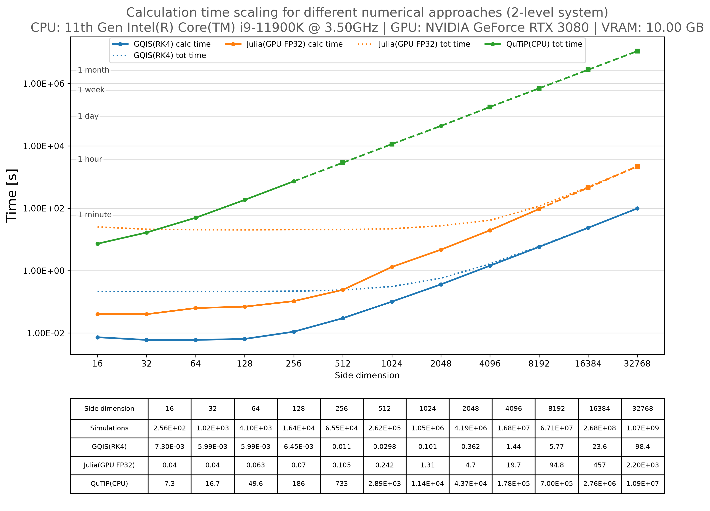
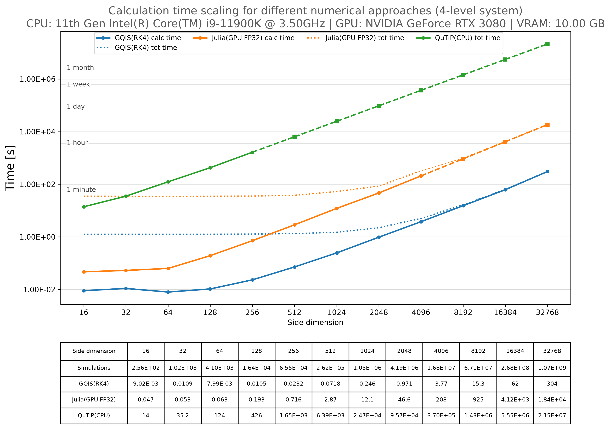
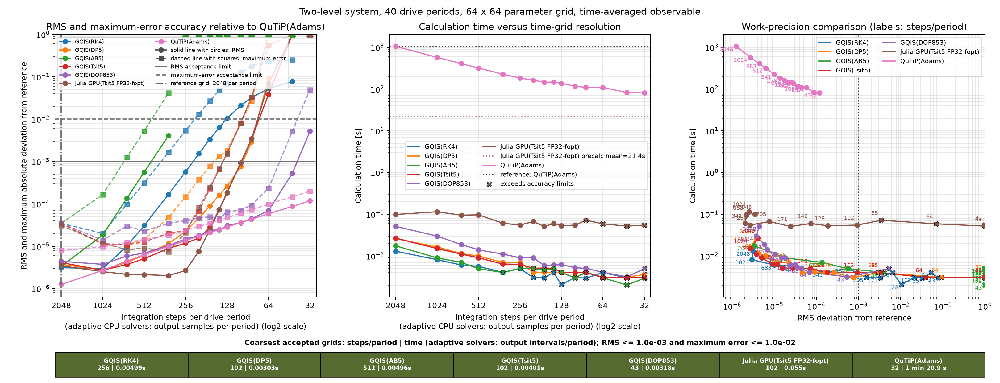

# Benchmark Validation And Performance

The accompanying benchmarks document GQIS solver accuracy and performance, including comparisons
with QuTiP, SciPy, Python RK4 and Julia backends. To apply GQIS to your own model, use the
[solver APIs](GQIS_API.md); the [working examples](README.md#examples) demonstrate those calls.

Use Benchmark 01/02 to compare solver results and measure parameter-sweep scaling.
Use Benchmark 03 to choose a solver and time resolution that satisfy RMS (root-mean-square)
and maximum-error limits against a numerical reference. The bundled problems are Lindblad systems;
normal package use, including general ODE sweeps, is described in the [API reference](GQIS_API.md).

## Benchmark 01 And 02: Comparison And Scaling

Both scripts have the same workflow and options; only the physical model differs:

| Script in `Benchmarks/` | Physical model |
| --- | --- |
| `Benchmark_01_two_level.py` | Driven two-level interferometry |
| `Benchmark_02_four_level_Interferometry.py` | Coupled qubit-resonator interferometry |

Edit `user_settings()` near the bottom of either script to choose the model parameters, grid,
solver, duration and output filename. Command-line arguments override those settings.
Run from the repository root, for example:

```bash
python Benchmarks/Benchmark_01_two_level.py --mode single --solver gqis_tsit5
python Benchmarks/Benchmark_02_four_level_Interferometry.py --mode diff --solver gqis_dop853 --solver-b qutip_cpu
```

| Mode | Result |
| --- | --- |
| `single` | One solver's interferogram and timing |
| `diff` | Two interferograms, timings, MSE, RMS and maximum absolute difference |
| `all` | Attempt all listed backends, including every GQIS method (`gpu` repeats RK4) |
| `full_benchmark` | Timings over powers-of-two square grids, saved as CSV and PNG |

All four modes accept these solver names:

| Name | Implementation |
| --- | --- |
| `gqis_rk4`, `gqis_lserk4`, `gqis_dp5`, `gqis_tsit5`, `gqis_anas5`, `gqis_ab5`, `gqis_alshina6`, `gqis_dop853` | GQIS fixed-step CUDA methods; `gpu` is an RK4 default alias |
| `python_cpu` | Python fixed-step RK4 reference on CPU |
| `python_ode_cpu` | Adaptive SciPy `solve_ivp`, RK45, on CPU |
| `qutip_cpu` | Adaptive QuTiP `mesolve` on CPU |
| `julia_gpu` | Julia DifferentialEquations/DiffEqGPU on the reduced physical ODE system |

See [method choices and costs](GQIS_API.md#available-fixed-step-solvers) for the GQIS methods.
Anas5 uses the model's drive angular frequency as its fitted frequency.

For scaling becnhmark, select several backends with `--full-solvers`:

```bash
python Benchmarks/Benchmark_01_two_level.py full_benchmark --full-solvers gqis_rk4,gqis_tsit5,gqis_dop853,qutip_cpu
```

The scripts' configured `accuracy_dividers_file` loads a matching Benchmark 03 calibration.
Set that setting to `None` to use the manually configured time grids. A calibrated scaling run uses the
calibration's model, duration, adaptive settings and solver-specific step counts; only the parameter-grid size changes.
See [calibration files](#calibration-files-and-compatibility) for overrides and older files.

Benchmark 01/02 print each solver's total steps and steps per driving period. For QuTiP and SciPy,
these counts describe requested output intervals; internal integration is adaptive. QuTiP also shows
a column progress bar with completion percentage and estimated remaining time. Use `--no-progress`
to hide the progress bar. If a solver is absent from the calibration JSON, the startup message
identifies the fallback time grid explicitly. Missing CPU solvers use one tenth of the original
`solver_steps_per_period` setting (256 by default, giving 26 after rounding), rather than one tenth
of the calibration JSON's base density. Solvers present in the JSON use their saved calibration.

Scaling CSVs record hardware, software, numerical settings and measured/extrapolated status in
`Benchmarks/results/`. Circles denote measurements; squares denote estimates after a solver reaches
or is predicted to exceed `bench_solver_time_limit`. CPU and Julia measurements run in terminable
subprocesses. GQIS runs in the warmed parent process; its time limit is checked after a solve completes.
Use `--help` for all CLI options and [timing details](#timing-boundaries-and-preparation) when interpreting performance.

### Two-Level time scaling:

Benchmark 01 shows calculation time for driven two-level interferograms as the number of parameter
sets increases. GQIS approaches linear scaling on large grids, reaching 1.07 billion simulations
in about **1 min 38 s** with RK4. Circles mark measurements; squares and dashed extensions mark
extrapolated timings. The largest measured QuTiP point is `2048 x 2048`, at about **12 h 9 min**.
That measurement comes from Benchmark 03 and is stored as a measured point in the Benchmark 01 CSV.

[Timing data (CSV)](./Benchmarks/results/Benchmark_01_full_benchmark.csv) | [Figure file (PNG)](./Benchmarks/results/Benchmark_01_full_benchmark_plot.png)



### Four-Level time scaling:

Benchmark 02 shows the same scaling comparison for the coupled qubit-resonator model. The larger
state makes each simulation more expensive; GQIS RK4 completes the largest grid of 1.07 billion
parameter sets in about **5 min 4 s**. Circles mark measurements; squares and dashed extensions
mark extrapolated timings. The largest measured QuTiP grid is `256 x 256`, taking about
**27 min 30 s**, versus **0.023219 s** for GQIS(RK4): approximately **71,100 times** speedup.

[Timing data (CSV)](./Benchmarks/results/Benchmark_02_full_benchmark.csv) | [Figure file (PNG)](./Benchmarks/results/Benchmark_02_full_benchmark_plot.png)



## Benchmark 03: Accuracy And Convergence

Benchmark 03 varies time resolution and compares the resulting observable map with a reference.
Choose `problem`, `target_solvers`, `reference_solver`, reference resolution, and RMS/maximum-error
limits in `user_settings()` or a JSON settings file. Increase reference accuracy until the reference
is sufficiently converged for the limits you want to test.

```bash
python Benchmarks/Benchmark_03_accuracy_timestep_sweep.py --settings Benchmarks/presets/Benchmark_03_two_level_64.json
```

Use `comparison_output="mean"` for a time-averaged interferogram or `"final"` for the final observable.
The sweep records errors and times, highlights the **coarsest tested grid passing both limits**, and can
save that selection for Benchmark 01/02 with `save_optimal_dividers=True`.
The coarsest accepted grid is not necessarily the fastest measured point when timings fluctuate.

Time resolution is shown as **steps per driving period**. For adaptive SciPy and QuTiP backends,
this quantity describes requested **output intervals per period**, not internal integration steps.
Adaptive tolerances control internal error. A dense GQIS integration grid is not required for adaptive
output: refine adaptive tolerances and output density separately until the compared observable converges.
Output density affects sampled averaging; array-based QuTiP drives also require converged coefficient interpolation.

For more Benchmark 03 options, see [presets and saved runs](#reproducing-accuracy-figures),
[calibration files](#calibration-files-and-compatibility), and [time-grid details](#time-grids-and-legacy-option-names).

## Benchmark 03 Results

The saved figures show observable error and calculation time as time resolution changes.
For QuTiP, steps per period means requested output intervals; internal integration is adaptive.
Calculation times belong to these accuracy runs, separately from the scaling measurements.

### Small Two-Level Grid accuracy scaling: Independent QuTiP Reference

The `64 x 64` sweep compares GQIS with a QuTiP reference using 2048 output intervals per period.
At fine resolution, the recorded GQIS methods agree with QuTiP to roughly `3-4e-6` RMS in the observable.



[Results (CSV)](Benchmarks/results/Benchmark_03_two_level_accuracy_timestep_sweep_GQIS_vs_QuTiP.csv)

### Dense Two-Level Grid accuracy scaling:

The `2048 x 2048` sweep uses GQIS RK4 at 4096 steps per period as the reference,
with RMS/maximum-error limits of `1e-3`/`1e-2`. Among the coarsest accepted GQIS points,
DOP853 has the shortest recorded time: **0.33592 s** at **43 steps per period**.
The measured QuTiP point takes about **12 h 9 min** and satisfies both limits.


[Results (CSV)](<Benchmarks/results/Benchmark_03_two_level_accuracy_timestep_dense grid_sweep.csv>)

### Dense Four-Level Grid accuracy scaling:

The `2048 x 2048` sweep uses the same reference resolution and error limits as the dense two-level sweep.
Here RK4 has the shortest recorded GQIS time among the coarsest accepted points:
**0.98360 s** at **146 steps per period**. DOP853 needs only **43 steps per period** but takes
**1.5141 s**, illustrating that even vastly different solvers, fourth-order for RK4 and eighth-order for DOP853, can provide quite similar performance when calibrated to the same accuracy limits.


[Results (CSV)](<Benchmarks/results/Benchmark_03_four_level_accuracy_timestep_dense grid_sweep.csv>)

The dense-grid errors measure agreement with a finer GQIS reference; the small-grid QuTiP result
provides the independent solver comparison. Each figure shows the methods recorded in its saved run.

## Plot Saved CSV Data

Both plot helpers rebuild figures without running a solver. Edit their `user_settings()` and run:

```bash
python Benchmarks/Benchmark_01_02_plot_from_csv.py
python Benchmarks/Benchmark_03_plot_from_csv.py
```

On Windows, use [Plot_Benchmark_01.bat](Benchmarks/Plot_Benchmark_01.bat) for the two-level figure
or [Plot_Benchmark_02.bat](Benchmarks/Plot_Benchmark_02.bat) for the four-level figure.
Each launcher selects its matching CSV and saves `Benchmark_01_full_benchmark_plot.png` or
`Benchmark_02_full_benchmark_plot.png` beside the data. The launchers use stored measurements and
estimates unchanged, keeping the figures consistent with the CSV-based speedup summaries.
Set `GQIS_PYTHON` to select a Python environment with NumPy and Matplotlib installed.

The equivalent command for Benchmark 01 is:

```bash
python Benchmarks/Benchmark_01_02_plot_from_csv.py --csv Benchmarks/results/Benchmark_01_full_benchmark.csv --stored-points
```

Use `--no-show` to save without opening a window, `--output` to choose another PNG path, or
`--solvers gqis_rk4 julia_gpu_fp32_fopt qutip_cpu` to select curves. The batch launchers also forward
these arguments. Figure styling continues to use the plot helper's `user_settings()`.

Common settings are `csv_file`, `include_solvers` (empty selects all), `show_results_table`,
`show_plot`, and `output_file`. With `output_file=None`, the figure is saved beside the CSV as
`<CSV stem>_plot.png`. Select solver identifiers as stored in the CSV.

**Benchmark 01/02 plotter:** draws calculation time versus simulation count. It also supports
`title`, `dpi`, `solver_labels`, `show_side_dimensions`, and `show_startup_times`.
See [adding measurements](#adding-measurements-to-a-scaling-plot) and
[preparation curves](#timing-boundaries-and-preparation) for optional changes.

**Benchmark 03 plotter:** draws accuracy and time versus steps per period. `table_times_only=True`
hides error rows; `show_best_summary_row=True` shows each solver's coarsest accepted steps per driving period and time.
The full table and work-precision point labels also use recorded steps per period; for adaptive
solvers, these counts describe requested output intervals per period.
`show_results_table=False` gives a compact figure. See [axis controls](#time-grids-and-legacy-option-names)
for alternative spacing and labels.

## Summary

Compare maps with Benchmark 01/02 `diff`; choose accurate time grids with Benchmark 03;
then use those grids in Benchmark 01/02 `full_benchmark`. Replot the saved CSV when only figure
formatting changes. Keep each result's settings with its CSV and figure so the calculation can be reproduced.

## Reproducing Accuracy Figures

The [Benchmark 03 preset details](Benchmarks/presets/Benchmark03_presets_details.md) describe
small two-level, dense two-level and dense four-level configurations. Windows launchers such as
[Run_Benchmark_03_two_level_64.bat](Benchmarks/Run_Benchmark_03_two_level_64.bat) run a preset;
[Plot_Benchmark_03_two_level_64.bat](Benchmarks/Plot_Benchmark_03_two_level_64.bat) plots its saved CSV.
Matching launchers exist for both dense profiles.

Benchmark 03 writes `<output_stem>_settings.json` alongside its results. Reproduce a saved run with:

```bash
python Benchmarks/Benchmark_03_accuracy_timestep_sweep.py --settings Benchmarks/results/<name>_settings.json
```

A preset is a starting configuration. The saved run's settings describe the actual measurement.
`--save-settings-only <name>_settings.json` exports the currently selected settings without calculating;
use that export for an older result only if those settings still match the completed run.

Enable `save_reference_map` on the first run and `load_reference_map` on later runs to reuse the
reference. Keep the reference filename and physical/numerical settings consistent. Dense QuTiP runs
can take more than 12 hours. GQIS saves after each solver sweep; Julia and QuTiP save after each point,
so completed portions can be plotted before the whole run finishes.

See [Benchmark 03 results](#benchmark-03-results) for the three saved convergence figures and their CSV data.

## Calibration Files And Compatibility

With `save_optimal_dividers=True`, `optimal_dividers_file=None` writes
`<output_stem>_optimal_dividers.json`. Despite the legacy filename, new files record each accepted
solver's actual steps per period, errors and time, plus complete Benchmark 03 settings.
Selections are refreshed after each solver finishes.

Load a matching file in Benchmark 01/02 using `accuracy_dividers_file`, or:

```bash
python Benchmarks/Benchmark_01_two_level.py full_benchmark --accuracy-dividers-file Benchmark_03_two_level_2048_optimal_dividers.json --full-solvers gqis_rk4,gqis_dop853,julia_gpu_fp32_fopt,qutip_cpu
```

Calibrated scaling supports Benchmark 03's Julia precision variants as well as the GQIS and CPU names.
The calibration's target list is used unless `accuracy_solvers` or `--full-solvers` overrides selection.
Saved steps per period are used directly, independent of Benchmark 01/02's base density.
Create a separate calibration for each model and accuracy target.

Relative calibration paths are searched in the working directory, `Benchmarks/results/`, beside the
script and in its parent directory. The model must match. `gpu` maps to `gqis_rk4`, and `julia_gpu`
maps to `julia_gpu_fp32`. Missing accepted entries use uncalibrated fallbacks: full base density for
GPU methods and one tenth of base density for CPU methods. The fallback is printed explicitly.

For older two-level calibration files without a settings snapshot, Benchmark 01 uses its configured
two-level profile with Benchmark 03 adaptive settings. For a four-level file without a snapshot,
or to select a specific manifest, supply `--accuracy-settings <matching-settings.json>`.
Existing files retain their recorded choices; regenerate calibration to apply today's selection rule.

## Time Grids And Legacy Option Names

Fixed-step GQIS and Python RK4 evolve through the requested final time. A uniform grid made with
`np.linspace(0, duration, n_steps + 1)` includes both endpoints and defines `n_steps` updates.
This is ordinary endpoint counting, not an extra integration convention. Floating-point time
representation still applies. Adaptive solvers also reach the final time, using their own internal steps.

`solver_steps_per_period` is Benchmark 01/02's base integration density. The existing CPU settings
`python_cpu_step_density_divider`, `python_ode_output_density_divider`, and
`qutip_output_density_divider` reduce that base density. For example, base density 2048 divided by
8 requests 256 intervals per period. Python RK4 uses the intervals as integration steps; SciPy and
QuTiP use them as output intervals. Keeping the same requested grid is an optional diagnostic,
not a requirement for accuracy validation.

Benchmark 03's settings and CSV schema retain divider names for compatibility. Actual rounded
`target_steps_per_period` is the meaningful resolution; the plots use steps per period by default.
In Benchmark 03 and its plot helper, `time_grid_axis="divider"` restores the alternative axis.
`divider_axis_scale="equidistant"` spaces tested grids evenly, and `divider_axis_labels="all"`
labels every tested grid. These legacy-named controls also apply to the steps-per-period axis.

## Adding Measurements To A Scaling Plot

In `Benchmark_01_02_plot_from_csv.py`, use `additional_csv_files` to merge another run or
`additional_measured_points` to enter measured values. Later entries replace a point with the same
solver identifier and side dimension. Combine only matching model, duration, precision, solver,
adaptive settings and solver-specific time grids; the plotter does not verify all these conditions.

For example, after replacing the illustrative time with a measurement from your matching run:

```python
"additional_measured_points": (
    {"solver": "qutip_cpu", "side_dimension": 2048, "time_s": 123.4, "status": "measured"},
),
"save_merged_csv": True,
```

The source CSV is preserved; `save_merged_csv=True` writes `<CSV stem>_merged.csv`.
With `refresh_extrapolated_points=True`, estimates between measured neighbors are interpolated in
log-log space; estimates beyond the measured range use the last two preceding measurements.
Updated estimates remain marked as extrapolated.

## Timing Boundaries And Preparation

**Julia:** the calculation timer encloses `solve(...)` and the following `CUDA.synchronize()`.
The plotted calculation time therefore includes work inside the solve call, including any transfers
performed by that interface. Symbolic preparation, Julia startup, warm-up, parameter setup and output
handling outside that interval contribute to preparation instead. The wrapper measures preparation
as total wrapper/subprocess time minus solve time; each point launches a fresh Julia process.

**GQIS:** scaling measurements use a warmed solve path. Benchmark 01 times its Python GPU wrapper;
Benchmark 02 records wrapper total and the `mesolve_2D` call separately. The calibrated path times
its GQIS wrapper. These measurements include host-side work and returned results, rather than only
the CUDA kernel. The API's `gpu_kernel_s` is a separate, narrower timer.

**CPU:** recorded times include the CPU solver workflow and its multiprocessing overhead.
QuTiP's plotted time is not a GPU-kernel comparison.

Scaling plots can add dotted `tot time` curves to `calc time` curves with `show_startup_times=True`.
Julia uses recorded `prep_s`; missing values use the mean available preparation as an estimate.
New GQIS runs record small-grid startup including a warm-up solve. Adding that startup to each
measured calculation estimates first use; it is not a measured cold full-grid run.
Older RHS-only metadata produces a `tot time*` curve identified by a footnote.
No preparation curve is drawn when preparation data is absent.

`preparation_overrides_s={"julia_gpu_fp32_fopt": seconds}` accepts a value recovered from a matching
run. `solver_labels` changes displayed names without changing CSV identifiers; retain precision and
stepping variants in the accompanying description when abbreviating a Julia name.

## Precision And Julia Comparison Notes

FP32 represents roughly seven significant decimal digits. Observable accuracy also depends on
step-size error, accumulated roundoff, drive evaluation, averaging and reference accuracy.
Refining the time grid helps until other errors dominate. Both GQIS APIs support `fp64=True`.

In the saved small two-level QuTiP comparison, GQIS at 2048 steps per period differs by roughly
`3.1-4.4e-6` RMS and `3.5e-5` maximum. In the dense four-level sweep, GQIS at 2048 steps per period
differs from the 4096-step-per-period GQIS RK4 reference by roughly `3-4e-7` RMS and `4-6e-6` maximum.
The latter is agreement with a GQIS reference, not an independent absolute-error bound.
These are model-specific observations, not universal FP32 accuracy limits.

The tested stock Julia `GPUTsit5` showed FP32 time-accumulation drift in long driven calculations.
Repeated addition of `dt` affected drive phase; finer steps did not always improve agreement.
The experimental integer-step time reconstruction reduced this effect in the saved tests.
Benchmark 03 and calibrated scaling retain all variants:

| Benchmark name | Time and state arithmetic |
| --- | --- |
| `julia_gpu_fp32` | Stock FP32 time and state; drift observed in the tested long runs |
| `julia_gpu_fp64` | FP64 time and state; slower on the reference GPU |
| `julia_gpu_fp32_opt` | Modified FP64 time accumulator with FP32 stages/state |
| `julia_gpu_fp32_fopt` | Modified integer-step reconstruction of FP32 time with FP32 state |

## Reference Results

Reference desktop system:

- CPU: 11th Gen Intel Core i9-11900K at 3.50 gigahertz (GHz)
- GPU: NVIDIA GeForce RTX 3080 with 10 gigabytes (GB) VRAM
- precision: 32-bit floating point (FP32) for the GQIS scaling runs
- workload: 10,240 RK4 steps per two-level simulation; 5,840 per four-level simulation

The largest measured `32768 x 32768` grids contain 1.07 billion independent simulations.
GQIS(RK4) completed them in about **1 min 38 s** for the two-level model and **5 min 4 s** for the four-level model.
The corresponding QuTiP estimates are **126.20 days** and **248.67 days**;
these largest-grid CPU values are extrapolated, not measured runs.

The [Benchmark 01 scaling CSV](Benchmarks/results/Benchmark_01_full_benchmark.csv) includes the
measured `2048 x 2048` QuTiP run imported from the
[Benchmark 03 dense two-level sweep](<Benchmarks/results/Benchmark_03_two_level_accuracy_timestep_dense grid_sweep.csv>).
The CSV records **12 h 9 min** as a measurement, so regenerating the scaling figure retains the point.
Other measured timings and existing extrapolations are preserved. The larger-grid averages below
use those stored extrapolations; they have not been refitted to the imported point.

| Model and measurement | Grid | QuTiP CPU time | GQIS(RK4) calculation time | Measured speedup |
| --- | --- | --- | --- | --- |
| Two-level, Benchmark 03 measurement imported into scaling | `2048 x 2048` | 12 h 9 min | 0.36223 s | approximately 120,800 times |
| Four-level | `256 x 256` | about 27 min 30 s | 0.023219 s | approximately 71,100 times |

Displayed times are rounded to at most five significant digits; long durations use hours and
minutes. Speedups are calculated from the unrounded recorded times. Each ratio compares measured
QuTiP and GQIS times at the same parameter-grid size, excluding GQIS preparation.

The two-level QuTiP run used 32 requested output intervals per driving period (1,280 over
40 periods), with adaptive internal integration. The calibrated RK4 run used 256 integration
steps per period (10,240 total).

The four-level runs use 5,840 RK4 steps and 1,280 QuTiP output intervals over 40 periods.
QuTiP extrapolations use the updated measurements through `256 x 256`.

For the four grid sizes from `4096 x 4096` through `32768 x 32768`, arithmetic means of the
point-by-point timing ratios are approximately **118,110× over QuTiP and 17.9× over Julia** for the two-level
model, and **88,040× over QuTiP and 60.6× over Julia** for the four-level model.
These ratios use the linked CSV calculation times for GQIS(RK4) and Julia's
`julia_gpu_fp32_fopt` variant, versus QuTiP's CPU run times; preparation is not added to the GPU calculation times.
Julia uses experimental integer-step FP32 time reconstruction in this comparison.
QuTiP timings in this range, and Julia timings beyond its measured range, are extrapolated as marked in the CSV.

The calibrated grids differ by solver. Per simulation, the two-level CSV records 10,240 RK4 steps,
1,720 DOP853 steps, 4,080 Julia steps and 1,280 QuTiP output intervals. The four-level CSV records
5,840 RK4 steps, 1,720 DOP853 steps, 5,840 Julia steps and 1,280 QuTiP output intervals.
QuTiP's internal adaptive integration steps are distinct from these output intervals.


