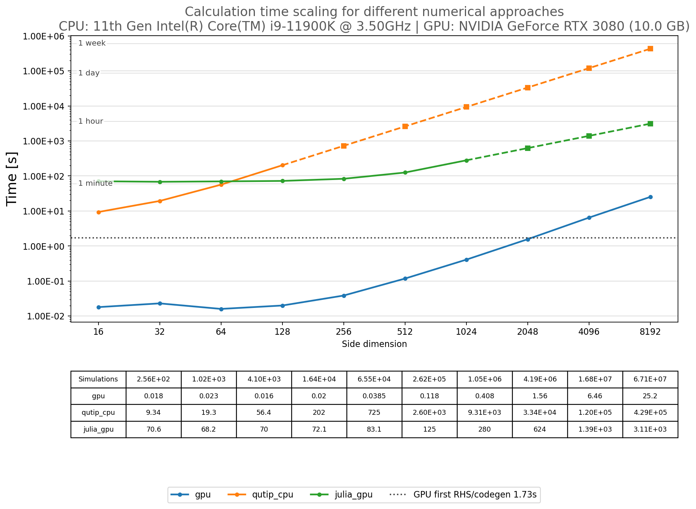

# Benchmark Validation And Performance

The benchmark scripts validate GQIS against independent numerical backends and demonstrate parameter-sweep scaling.
They are supporting evidence for the solver, not the primary GQIS interface. The runnable examples and
[`mesolve_2D` API](./GQIS_API.md) describe normal use.

## Models

- `Benchmark_01_two_level.py` evaluates a driven two-level system.
- `Benchmark_02_four_level_Interferometry.py` evaluates a coupled qubit-resonator model represented by four basis
  states.

Both benchmarks offer the same solver choices:

| Solver | Method |
| --- | --- |
| `gpu` | GQIS fixed-step RK4 on CUDA. |
| `python_cpu` | Transparent fixed-step Python RK4 reference. |
| `python_ode_cpu` | Adaptive SciPy `solve_ivp` RK45 on CPU. |
| `qutip_cpu` | Adaptive QuTiP `mesolve` reference on CPU. |
| `julia_gpu` | Julia DifferentialEquations/DiffEqGPU solver using the same reduced density-matrix ODE as GQIS. |

## Running Benchmarks

The user-editable block near the bottom of each script documents the model, grid, solver, and output settings. Run the
default configuration with:

```bash
python Benchmark_01_two_level.py
python Benchmark_02_four_level_Interferometry.py
```

The available modes are:

| Mode | Purpose |
| --- | --- |
| `single` | Run one selected backend. |
| `diff` | Run any two backends and report map differences and timings. |
| `all` | Attempt every available backend. |
| `full_benchmark` | Measure calculation time over powers-of-two square-grid sizes and save CSV/PNG results. |

For example, compare GQIS with QuTiP using the settings selected in the benchmark file:

```bash
python Benchmark_02_four_level_Interferometry.py --mode diff --solver gpu --solver-b qutip_cpu
```

`diff` mode prints mean-square deviation (MSE), root-mean-square deviation (RMS), maximum absolute deviation, and both
solver times. Increase `solver_steps_per_period` until the GQIS result is converged. Use divider `1` for QuTiP or SciPy
when validating every backend on the same requested coefficient/output grid.

Run either script with `--help` for its complete command-line options. Those options override `user_settings()`.

> Running `all` or `full_benchmark` can take considerable time, especially with adaptive CPU solvers. Full benchmark
> mode terminates measurements that exceed its configured limit and extrapolates larger grids instead of leaving a
> timed-out process running.

## Numerical Comparison Notes

- GQIS and `python_cpu` use fixed-step RK4. The `python_cpu` divider defaults to `1`, matching the GQIS step density.
- `python_ode_cpu` and `qutip_cpu` choose adaptive internal steps. Their default divider of `10` reduces the requested
  coefficient/output grid, not the internal adaptive accuracy target. Set it to `1` for a same-requested-grid check.
- If a time list contains `M` samples, it defines `M - 1` integration intervals. `N` always denotes the number of
  simulated quantum levels, not the time-grid length.
- The Julia backend solves the same trace- and Hermiticity-reduced physical ODE system as GQIS. Its scaling value is the
  synchronized Julia solve time; symbolic preparation is excluded.
- The reference timings are hardware- and model-specific. Compare numerical output first, then interpret speed.

## Full Scaling Benchmark

Full benchmark mode measures powers-of-two square grids. Measured plot points use circles. Once a solver exceeds or is
predicted to exceed the time limit, larger values are extrapolated in log-log coordinates and plotted as squares using
the same solver color. Extrapolation is intended to show scaling estimates, not substitute for measured data.

Each generated CSV stores the equipment and software versions, physical and numerical configuration, grid dimensions,
number of simulations, solver, timing components, and measured/extrapolated status. The benchmark also saves its PNG
figure automatically so a long run can be compared with the reference results later.

## Reference Results

Reference workstation:

- CPU: 11th Gen Intel Core i9-11900K at 3.50 GHz
- GPU: NVIDIA GeForce RTX 3080 with 10 GB VRAM
- precision: FP32 for the GQIS scaling runs
- workload: 10,240 fixed RK4 steps per GQIS trajectory

The largest measured `32768 x 32768` grids contain 1.07 billion independent trajectories. GQIS completed them in
about 1 minute 44 seconds for the two-level model and 7 minutes 1 second for the four-level model. Direct QuTiP runs at
this resolution were not practical; extrapolation from measured smaller grids estimates about 69 days and 108 days,
respectively.

Across the approximately linear large-grid region from `4096 x 4096` through `32768 x 32768`, average point-by-point
speedups were about 69,000 times over QuTiP and 22 times over Julia for the two-level model, and 24,000 times over QuTiP
and 38 times over Julia for the four-level model. The QuTiP and Julia values in this region include extrapolated timings
after each reference backend reaches the configured practical limit.

### Two-Level Reference

[Timing data (CSV)](./Benchmark_01_full_benchmark.csv) | [Figure file (PNG)](./Benchmark_01_full_benchmark.png)


### Four-Level Reference

[Timing data (CSV)](./Benchmark_02_full_benchmark.csv) | [Figure file (PNG)](./Benchmark_02_full_benchmark.png)



## Reporting New Results

Keep the automatically generated CSV and PNG together. The CSV is the authoritative record of hardware, software,
model, time-grid, precision, CPU-divider, sweep-limit, preparation, calculation, and measured/extrapolated metadata.
Regenerate both files after solver or benchmark changes before citing performance.
