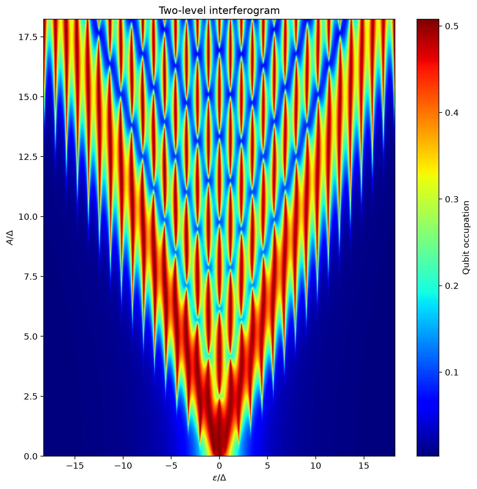
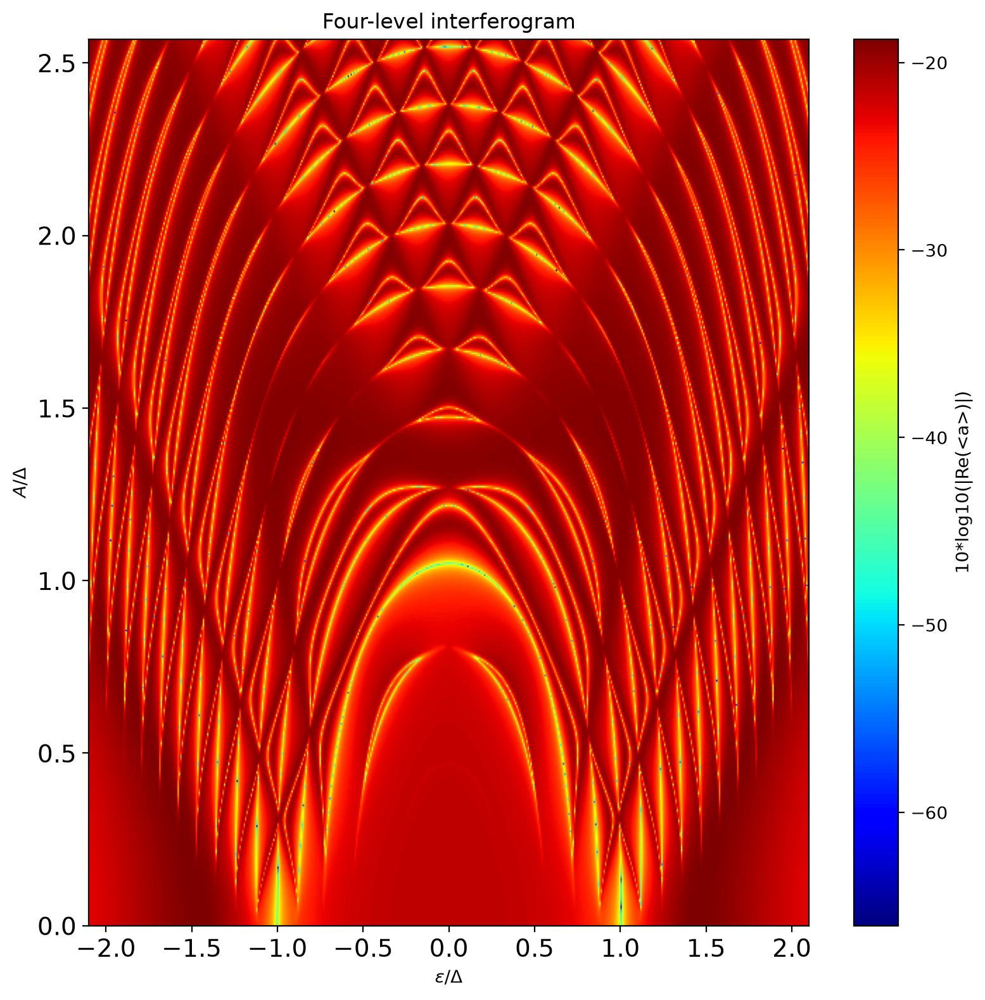
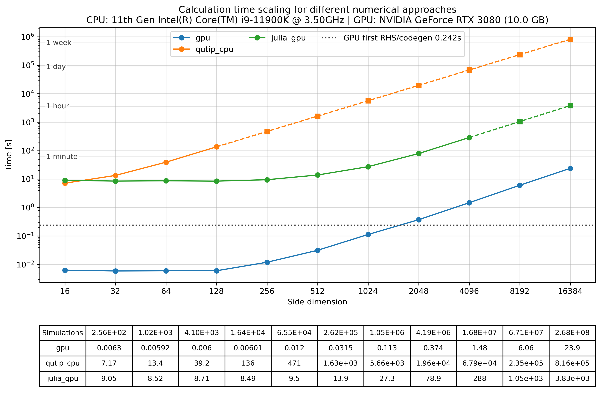

# GPU Quantum Interferometry Solver (GQIS)

The GPU Quantum Interferometry Solver (`GQIS`) is a Python/NVIDIA CUDA research package for large parameter sweeps of
driven open quantum systems. GQIS evaluates independent simulations in parallel on an NVIDIA graphics processing unit
(GPU), supporting workloads from tutorial-scale examples to parameter grids containing millions or even billions of
simulations.

The physical model is symbolic: the Hamiltonian, drive, collapse operators, and measured operator are written as SymPy
expressions in which selected physical parameters remain named symbols instead of immediately becoming fixed numbers.
GQIS converts this model into the equations and CUDA code used for the parameter sweep.

## Why GQIS Was Created

High-resolution quantum interferometry requires a parameter sweep that repeats the same time-evolution calculation for
many combinations of physical parameters, with each combination producing one point in a two-dimensional map. Fitting a
model to experimental data often requires the complete map to be recalculated for many candidate parameter sets. The
slowness of these central processing unit (CPU) calculations motivated this project: one sufficiently resolved
interferogram could take from 30 minutes to several hours. Repeating that calculation during parameter fitting could
therefore take days or weeks, while reducing the resolution risked missing narrow interference features.

Many quantum-dynamics packages evaluated during GQIS development were designed primarily to evolve one parameter set
per solver call. Large parameter sweeps consequently required Python code to launch and coordinate many separate solver
calls. Julia was an important exception and provided capable GPU parameter sweeping. However, the tested Julia workflow
required a prepared system of ordinary differential equations (ODEs) and substantial single-threaded CPU preparation
before GPU execution. Structural changes to the Hamiltonian, collapse operators, or measured operator therefore
required the reduced ODE system to be derived and implemented again.

GQIS connects a symbolic open-system model directly to a CUDA kernel optimized for large parameter sweeps. Its symbolic
generator derives the required density-matrix equations, eliminates repeated operations, and precomputes reusable
parameter combinations. The generated equations are then inserted into a compact CUDA kernel that evolves one parameter
set per GPU thread. On the reference RTX 3080, representative `2048 x 2048` interferograms complete in a few seconds,
making repeated parameter studies and animations that vary an additional physical parameter affordable and practical.
Controlled timing comparisons are reported in [Validation And Performance](#validation-and-performance).

## Installation

GQIS supports Python 3.10 and 3.11 and requires an NVIDIA CUDA-capable GPU plus one CuPy distribution matching the
CUDA major version. Install the tested CUDA 12 configuration with:

```bash
pip install "gqis[cuda12]"
```

Replace `cuda12` with `cuda11` or `cuda13` when using a different CUDA major version. Add the `examples` extra for
plotting support, then run the installation test:

```bash
pip install "gqis[cuda12,examples]"
gqis-check --installation-test
```

See the [installation and GPU test
guide](https://github.com/Olegiv95/Gpu-Quantum-Interferometry-Solver/blob/main/INSTALLATION_TEST.md) for optional isolated
environments, troubleshooting, source installs, optional dependencies, tested versions, FFmpeg, Julia, automated tests,
and updates.

## Minimal Use

Import the packaged solver and pass a symbolic model plus one or two numerical sweep axes:

```python
from gqis import mesolve_2D

result = mesolve_2D(
    H, Drive, Col_Ops, mean_operator, tlist,
    var_arrays={eps: eps_values, A: amplitude_values},
)
```

Five mandatory positional arguments are:

1. `H`: `N x N` symbolic Hamiltonian, where `N` is the number of simulated quantum levels.
2. `Drive`: SymPy expression for the time-dependent drive, or a dictionary defining multiple time-dependent terms.
3. `Col_Ops`: sequence of `N x N` Lindblad collapse operators representing processes such as relaxation and dephasing.
4. `mean_operator`: `N x N` operator associated with the physical quantity whose expectation value is requested.
5. `tlist`: one-dimensional, uniformly spaced time grid beginning at zero.

If `tlist` contains `M` time samples, the solver performs `M - 1` fixed fourth-order Runge-Kutta (RK4) steps. The example
above returns one time-averaged expectation value of `mean_operator` for every combination of parameter values from the
two sweep arrays.

See the [complete `mesolve_2D` application programming interface (API)
reference](https://github.com/Olegiv95/Gpu-Quantum-Interferometry-Solver/blob/main/GQIS_API.md) for symbolic constants,
initial-state sweeps, output modes, sampled time traces, kernel reuse, precision, timings, and code-generation controls.

## Examples

| Script | Demonstration |
| --- | --- |
| `Example_01_two_level_basic.py` | Basic two-level interferogram. |
| `Example_02_four_level_interferogram.py` | Coupled qubit-resonator interferogram. |
| `Example_03_two_level_animation.py` | Two-level animation that reuses the generated equations and compiled kernel between frames. |
| `Example_04_four_level_animation.py` | Four-level animation that changes selected physical constants without recompilation. |
| `Example_05_initial_condition_sweep_gate_fidelity.py` | Initial-state sweep and gate-fidelity comparison. |

Run an example from the repository root:

```bash
python Example_01_two_level_basic.py
```

The examples print the actual preparation and calculation time for their selected grid, time grid, and physical
parameters. Animation examples print per-frame times, plus total video calculation/export time when saving. Reduce
`grid_size` in the `user_settings()` block for a quicker run or for a GPU with less memory.

<table>
  <tr>
    <td width="50%"></td>
    <td width="50%"></td>
  </tr>
  <tr align="center">
    <td><strong>Example 01:</strong> two-level interferogram</td>
    <td><strong>Example 02:</strong> coupled qubit-resonator interferogram</td>
  </tr>
</table>

## Supported Models And Outputs

The user supplies the physical model and requested output. A solver call
can contain:

- any finite-dimensional SymPy Hamiltonian, optionally containing named symbols mapped to one or more time-dependent
  drive expressions
- any list of Lindblad collapse operators with the same `N x N` shape as the Hamiltonian
- an operator whose expectation value is averaged, returned at the final time, or sampled over time
- one or two numerical parameter-sweep axes
- a common initial density matrix, a symbolic initial-state sweep, or a numerical initial state supplied for each
  simulation point
- selected physical constants whose numerical values can change without regenerating the ODE system

For the Lindblad master equation of an `N x N` Hermitian, unit-trace density matrix, let $D=N^2-1$ denote the number
of retained real equations. GQIS removes equations made redundant by unit trace and Hermiticity (conjugate symmetry)
and derives a coupled system of $D$ independent real ODEs. Here, independent means that every retained equation is
required and none can be excluded without losing information; the equations remain coupled and are solved together.
Output modes include a time-averaged expectation value, the expectation value at the final time, the final reduced
density matrix, and an optional sampled time trace of the expectation value; see the [API
output-mode
reference](https://github.com/Olegiv95/Gpu-Quantum-Interferometry-Solver/blob/main/GQIS_API.md#initial-state-and-output)
for details. [Example 05](https://github.com/Olegiv95/Gpu-Quantum-Interferometry-Solver/blob/main/Example_05_initial_condition_sweep_gate_fidelity.py)
uses `output_mode="final_rho"` for final-state gate-fidelity calculations. GQIS does not interpret physical units or basis
labels; define all model quantities in compatible units and one consistent basis.

## Solver Pipeline

GQIS consists of two principal components:

The symbolic generator starts from the Lindblad master equation

```math
\frac{d\rho}{dt} = -i[H(t),\rho]
+ \sum_j \left(C_j\rho C_j^\dagger
- \frac{1}{2}C_j^\dagger C_j\rho
- \frac{1}{2}\rho C_j^\dagger C_j\right),
```

where $\rho$ is the density matrix, $H(t)$ is the time-dependent Hamiltonian, and each $C_j$ is a collapse operator.
The Hamiltonian coefficients and time variable must use mutually consistent units.

1. **Symbolic equation generator:** constructs the Lindblad master equation from the user-defined model, reduces it to
   a coupled system of independent real ODEs, eliminates repeated operations, precomputes parameter-only
   combinations where possible, and emits CUDA C expressions for the right-hand side (RHS), meaning the time
   derivatives in the ODE system.
2. **CUDA execution kernel:** uses a minimal fixed-step RK4 implementation with one parameter set per GPU thread. In
   averaged and final-output modes, it retains only the state and intermediate values needed for integration, calculates
   the requested expectation values during evolution, and returns the time average or final reduced density matrix
   without storing the complete time evolution in GPU memory.

Using this notation, denote the $D$ retained density-matrix components, represented by real values, as
$y_1,\ldots,y_D$. GQIS generates the system of ODEs

```math
\begin{cases}
\dfrac{dy_1}{dt} = R_1(t,y_1,\ldots,y_D), \\
\dfrac{dy_2}{dt} = R_2(t,y_1,\ldots,y_D), \\
\qquad\vdots \\
\dfrac{dy_D}{dt} = R_D(t,y_1,\ldots,y_D).
\end{cases}
```

Here, $R_i$ is the generated right-hand side of equation $i$. The vector function $f$ used below combines all $D$
right-hand sides. The fourth-order Runge-Kutta (RK4) update is:

```math
\begin{aligned}
\mathbf{k}_1 &= \mathbf{f}(t_n,\mathbf{y}_n), \\
\mathbf{k}_2 &= \mathbf{f}\left(t_n+\frac{h}{2},\mathbf{y}_n+\frac{h}{2}\mathbf{k}_1\right), \\
\mathbf{k}_3 &= \mathbf{f}\left(t_n+\frac{h}{2},\mathbf{y}_n+\frac{h}{2}\mathbf{k}_2\right), \\
\mathbf{k}_4 &= \mathbf{f}\left(t_n+h,\mathbf{y}_n+h\mathbf{k}_3\right), \\
\mathbf{y}_{n+1} &= \mathbf{y}_n+\frac{h}{6}
\left(\mathbf{k}_1+2\mathbf{k}_2+2\mathbf{k}_3+\mathbf{k}_4\right).
\end{aligned}
```

In this formula, $n$ is the starting time-sample index of the current interval, $y_n$ is the state at time $t_n$, and
$f(t_n,y_n)$ is the vector of all derivatives evaluated at that time and state. A grid of
$M$ time samples contains $t_0,\ldots,t_{M-1}$ and therefore defines $M-1$ integration intervals, each with duration
$h=t_{n+1}-t_n$.

This RK4 update is applied by every GPU thread to its own evolution with its parameter set.

For a new model, these components perform the following pipeline:

<table>
  <tr align="center">
    <td><strong>1.</strong> Define <em>H</em>, drives,<br>collapse operators and observable</td>
    <td>&rarr;</td>
    <td><strong>2.</strong> Build Lindblad<br>master equation</td>
    <td>&rarr;</td>
    <td><strong>3.</strong> Reduce density-matrix<br>equations</td>
    <td>&rarr;</td>
    <td><strong>4.</strong> Simplify and optimize<br>the symbolic RHS</td>
  </tr>
  <tr align="center">
    <td colspan="6"></td>
    <td>&darr;</td>
  </tr>
  <tr align="center">
    <td><strong>8.</strong> Launch the 2D sweep:<br>one thread per point</td>
    <td>&larr;</td>
    <td><strong>7.</strong> Compile and cache<br>with CuPy and the CUDA compiler</td>
    <td>&larr;</td>
    <td><strong>6.</strong> Insert code into<br>the kernel template</td>
    <td>&larr;</td>
    <td><strong>5.</strong> Generate CUDA C<br>for RHS and expectation value</td>
  </tr>
  <tr align="center">
    <td>&darr;</td>
    <td colspan="6"></td>
  </tr>
  <tr align="center">
    <td><strong>9.</strong> Evolve with RK4 and<br>calculate expectation values</td>
    <td>&rarr;</td>
    <td><strong>10.</strong> Return the 2D<br>NumPy result</td>
    <td colspan="4"></td>
  </tr>
</table>

Later calls can reuse the generated RHS and compiled CUDA kernel when the symbolic structure of the model is unchanged,
so they can start from stage 8. Sweep arrays, numerically supplied initial states, and the numerical values of selected
constants deliberately kept symbolic may then change without recompilation. This is particularly useful for animations
that vary one physical parameter between frames. See [Reusing The ODE For
Animations](https://github.com/Olegiv95/Gpu-Quantum-Interferometry-Solver/blob/main/GQIS_API.md#reusing-the-ode-for-animations)
for details.

Important implementation choices are:

- the Hamiltonian and collapse operators are supplied as symbolic SymPy matrices
- a coupled system of independent real ODEs is generated automatically rather than derived and maintained by
  hand
- only independent density-matrix components are evolved after applying unit-trace and Hermiticity relations to remove
  redundant calculations
- only the requested sweep output is transferred back to CPU memory, without storing other intermediate data to save memory

## Validation And Performance

The benchmark scripts support the solver rather than define its interface. They compare GQIS output with trusted CPU
solvers and show how calculation time changes with the size of the parameter grid:

- `Benchmark_01_two_level.py`: driven qubit model
- `Benchmark_02_four_level_Interferometry.py`: coupled qubit-resonator model

On the reference RTX 3080, the largest measured `32768 x 32768` grids contain 1.07 billion independent parameter sets,
with 10,240 RK4 steps per simulation. GQIS completed these runs in about 1 minute 44 seconds for the two-level model and
7 minutes 1 second for the four-level model. Across the linear scaling region, where calculation time increases in
proportion to the number of simulations, the average reported speedups were about 69,000 times and 24,000 times over
QuTiP timings extrapolated from smaller measured grids for the two- and four-level models, respectively.

The compact GQIS kernel retains the reduced state and RK4 working values instead of storing each complete time
evolution. In the tested large sweeps, this execution design used less video random-access memory (VRAM) than the Julia
comparison solver.

<p align="center">
  <a href="./Benchmark_01_full_benchmark.png">
    
  </a>
</p>
<p align="center"><em>Two-level scaling reference. Click the figure for the full-resolution result.</em></p>

Comparing every solver or running a full scaling sweep can take considerable time. The scripts print progress, enforce
a configurable solver time limit, save comma-separated values (CSV) data and Portable Network Graphics (PNG) figures,
and mark extrapolated data. See [benchmark validation,
methodology, and complete reference results](https://github.com/Olegiv95/Gpu-Quantum-Interferometry-Solver/blob/main/BENCHMARKS.md)
before interpreting or reproducing these numbers.

> **Numerical accuracy disclaimer:** GQIS 0.1.0 is an alpha release. The current CUDA solver uses fixed-step
> fourth-order Runge-Kutta (RK4) integration on the user-supplied uniform time grid. Verify time-grid convergence by
> repeating calculations with smaller steps. For important results, compare against a trusted adaptive reference solver,
> which automatically adjusts its internal time steps. RK4 is not suitable for every problem, and its accuracy and
> stability depend on the time-step size. QuTiP is the primary reference used by the included validation benchmarks.

## Project Layout

- `gqis/` contains the solver, public interface, environment checker, and CUDA kernel template.
- `Example_*.py` contains runnable tutorials.
- `Benchmark_*.py` contains numerical comparisons and scaling measurements.
- `GQIS_API.md`, `INSTALLATION_TEST.md`, and `BENCHMARKS.md` provide detailed guidance.
- `tests/` and `.github/workflows/ci.yml` contain automated checks.

## Contributing

Bug reports, validation results from other GPUs, documentation corrections, and focused code contributions are welcome.
See [CONTRIBUTING.md](https://github.com/Olegiv95/Gpu-Quantum-Interferometry-Solver/blob/main/CONTRIBUTING.md)
before opening an issue or pull request.

## Citation

If you use GQIS in a publication, please cite the software using the metadata in
[CITATION.cff](https://github.com/Olegiv95/Gpu-Quantum-Interferometry-Solver/blob/main/CITATION.cff). A paper citation or
archival digital object identifier (DOI) will be added when available.

## License

This project is released under the [MIT License](https://github.com/Olegiv95/Gpu-Quantum-Interferometry-Solver/blob/main/LICENSE).
