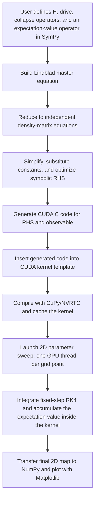

# GPU Quantum Interferometry Solver (GQIS)

The GPU Quantum Interferometry Solver (`GQIS`) is a Python/CUDA research
package for fast two-dimensional parameter sweeps of driven open quantum
systems. It converts a symbolic Lindblad master-equation model written with
SymPy into CUDA code, compiles it with CuPy/NVRTC, and runs one independent
parameter point per GPU thread.

The main target is quantum interferometry: dense grids of low-dimensional open-system simulations where a CPU loop over parameter points becomes the bottleneck. The solver is not hard-coded for a two-level system. You provide the Hamiltonian matrix, collapse operators, observable, drive expression, and optional initial density matrix. In principle this can represent any finite-dimensional Lindblad model that fits in GPU memory and has equations small enough for CUDA compilation.

## Why This Tool Exists

Many quantum dynamics tools are excellent for one system, one parameter set, or a moderate number of CPU-parallel jobs. Interferometry often needs millions of independent low-dimensional simulations on a rectangular grid. In that regime, moving only a single trajectory to the GPU is not enough: the parameter sweep itself must live inside the GPU kernel.

`GQIS` is designed for that case. It compiles the model once, sends the parameter grid to the GPU, integrates every grid point in parallel, accumulates the requested observable inside the kernel, and transfers only the final 2D result back to CPU memory for plotting.

## Solver Pipeline

This is the principal solver scheme used by the examples and benchmarks:



Distinct implementation choices:

- The Hamiltonian and collapse operators are ordinary SymPy matrices, so the physics model remains readable.
- The Lindblad RHS is generated symbolically, then converted into CUDA code instead of being interpreted inside Python.
- Only independent density-matrix variables are evolved, reducing unnecessary work.
- The CUDA kernel computes the observable during integration, so every time step does not need to be stored in GPU memory.
- Runtime constants can be changed for animations without regenerating the full symbolic RHS when the equation structure is unchanged.
- Symbols that remain part of the equation structure participate in the RHS cache key; numeric sweep arrays and explicit initial-state arrays can change without recompiling that structure.

## Benefits For Massive Parameter Sweeps

- `GQIS` avoids a Python-level loop over millions of parameter points.
- One compiled kernel can evaluate a full 2D interferogram where each thread solves one independent low-dimensional system.
- Dense GPU sweeps are useful for thin resonances, where low-resolution CPU scans can miss structure.
- The workflow stays in Python/SymPy/CuPy while still producing compiled CUDA kernels.
- QuTiP remains the recommended CPU reference for validation, but GQIS is intended for the high-throughput sweep after the model and resolution are validated.

This tool is not a replacement for general-purpose quantum solvers. It is specialized for structured, independent parameter sweeps where a fixed time grid is acceptable after convergence checks.

## Supported Models And Outputs

The solver is not limited to the included two- and four-level examples. A user supplies:

- any finite-dimensional SymPy Hamiltonian `H`, including one or more symbolic drive placeholders
- a SymPy expression, or a dictionary of expressions, defining the time-dependent drives
- any list of Lindblad collapse operators with dimensions matching `H`
- an output operator whose expectation value is accumulated or sampled
- up to two parameter-sweep axes
- an optional symbolic initial density matrix, symbolic initial-state sweep, or explicit array of initial reduced density matrices

`mesolve_2D` constructs the Lindblad equation, reduces the Hermitian trace-one density matrix to `N*N - 1` independent real variables, generates CUDA expressions for the RHS and observable, inserts them into the packaged CUDA template, compiles with NVRTC, and launches one independent trajectory per GPU thread. The practical system dimension is limited by generated-code size, register pressure, compilation resources, and GPU memory rather than by a hard-coded two-level model.

Output modes include a time-averaged observable, a final observable, the final reduced density matrix, and an optional sampled observable trace. See [GQIS_API.md](GQIS_API.md) for every argument and helper function.

## Units And Basis Conventions

The solver is unit-agnostic. The included examples use dimensionless model
parameters normalized by a selected energy-gap scale. All Hamiltonian
coefficients, drive frequencies, and dissipative rates in one model must use
the same frequency convention. A physical model may use either ordinary
frequency or angular frequency after consistent normalization; mixing the two
introduces an unwanted factor of `2*pi`. The corresponding time variable must
use the reciprocal convention so that every phase argument is dimensionless.

Labels such as `|0>` and `|1>` identify states of the basis used to construct
the Hamiltonian. They are not automatically energy-ground and energy-excited
states. The Hamiltonian determines its instantaneous energy eigenstates, while
collapse operators specify the dissipative transition directions represented
in the model.

## Installation

Core requirements are Python 3.10 or newer, NumPy, SymPy, an NVIDIA CUDA-capable GPU, and exactly one CuPy distribution matching the CUDA major version. Pip cannot detect the CUDA major version and choose a CuPy wheel interactively, so CUDA support is provided through explicit extras.

For the tested CUDA 12 configuration, install the package and plotting examples with:

```bash
pip install ".[cuda12,examples]"
```

Use `cuda11` with CuPy 13 for CUDA 11, or `cuda13` for CUDA 13. Do not install multiple `cupy`, `cupy-cuda11x`, `cupy-cuda12x`, or `cupy-cuda13x` distributions in the same environment.

Install benchmark dependencies:

```bash
pip install ".[cuda12,examples,benchmarks]"
```

Install all CUDA 12 development, benchmark, and test dependencies:

```bash
pip install -e ".[all-cuda12]"
```

The first two commands create standalone installations that do not depend on
the source folder remaining in place. Use editable mode only while developing
the package:

```bash
pip install -e ".[cuda12,examples]"
```

Members with access to the private GitHub repository can install the current
`main` branch directly when GitHub authentication is configured:

```bash
pip install "gpu-quantum-interferometry-solver[cuda12,examples] @ git+https://github.com/Olegiv95/Gpu-Quantum-Interferometry-Solver.git@main"
```

Research-group members should follow
[RESEARCH_GROUP_SMOKE_TEST.md](RESEARCH_GROUP_SMOKE_TEST.md) for complete
clean-environment installation, private GitHub authentication, CUDA selection,
smoke-test, update, and environment-deactivation commands.

Optional external programs are FFmpeg for MP4 export and Julia with `DifferentialEquations`, `DiffEqGPU`, `CUDA`, and `StaticArrays` for Julia GPU comparisons. `requirements.txt` provides a CUDA 12-oriented non-package installation list.

Dependency roles and minimum versions are:

- NumPy 1.24 and SymPy 1.11 are core model/code-generation dependencies.
- Exactly one compatible CuPy package is the required CUDA runtime interface: `cupy-cuda11x>=13,<14`, `cupy-cuda12x>=13`, or `cupy-cuda13x>=14`.
- Matplotlib 3.7 is optional for examples, plots, and animations; FFmpeg is an optional external executable for MP4 output.
- SciPy 1.10 and QuTiP 5.0 are optional adaptive/reference CPU benchmark backends.
- Julia and its `DifferentialEquations`, `DiffEqGPU`, `CUDA`, and `StaticArrays` packages are optional for the Julia comparison backend.
- pytest 8 and build 1 are optional test and distribution-build tools. Setuptools 77 or newer and wheel are installed automatically in an isolated package build.

CuPy cannot be one unconditional dependency because its binary package name is
CUDA-major-specific. Pip does not prompt for or reliably detect that choice
while resolving package metadata; selecting the matching `cuda11`, `cuda12`, or
`cuda13` extra is explicit and avoids installing conflicting CuPy wheels.

On Windows, installing FFmpeg is not sufficient if its `bin` directory is not
on `PATH`. Confirm the same terminal used to run Python can execute
`where ffmpeg` and `ffmpeg -version`; Matplotlib's `FFMpegWriter` uses that PATH
lookup unless `matplotlib.rcParams["animation.ffmpeg_path"]` is set explicitly.

Check the environment:

```bash
python check_environment.py
```

After package installation, the equivalent command is:

```bash
gqis-check
```

Run a tiny GPU smoke test:

```bash
python check_environment.py --smoke
```

The smoke solve runs in a child process and is terminated after 120 seconds by
default. Change the bound with `--smoke-timeout SECONDS`.

To check Julia benchmark packages as well:

```bash
python check_environment.py --check-julia-packages
```

## Tests

Examples and benchmarks exercise realistic workflows, but they are not a
replacement for automated tests: they are comparatively slow, depend on local
GPU/plotting software, and generally do not assert known numerical answers.

Run the fast package and time-grid tests, without requiring a working GPU:

```bash
pytest -m "not gpu"
```

Run the optional CUDA numerical smoke test as well:

```bash
pytest
```

The GitHub Actions workflow builds the source distribution and wheel and runs
the non-GPU tests. Numerical convergence against QuTiP should still be checked
before publishing scientific results or changing the CUDA integration core.

## Tested Local Environment

The reference benchmark files were produced on an RTX 3080 workstation. The environment checker reports the exact machine metadata and the full benchmark CSV files store it at the top of the file.

Example tested environment:

```text
Python: 3.11.7
OS: Windows 11 Home (25H2, build 26200.8655)
CPU: 11th Gen Intel(R) Core(TM) i9-11900K @ 3.50GHz
GPU: NVIDIA GeForce RTX 3080, compute capability 8.6, memory 10.00 GB
NumPy: 1.26.4
SymPy: 1.12
Matplotlib: 3.8.0
CuPy: 13.0.0
QuTiP: 5.2.0
Julia: 1.10.2
```

## Quick Start

Installed code should import the packaged interface:

```python
from gqis import mesolve_2D
```

The former `from gpu_int_tool import mesolve_2D` and
`from GPU_Int_Tool import mesolve_2D` forms remain available as compatibility
imports. New code should use `gqis`.

Run the two-level tutorial:

```bash
python Example_01_two_level_basic.py
```

Run the four-level interferogram tutorial:

```bash
python Example_02_four_level_interferogram.py
```

Run the two-level animation:

```bash
python Example_03_two_level_animation.py
```

Run the four-level animation:

```bash
python Example_04_four_level_animation.py
```

Run the initial-state sweep and gate-fidelity tutorial:

```bash
python Example_05_initial_condition_sweep_gate_fidelity.py
```

Tutorial examples use visible GPU-sized grids by default. If your GPU is smaller or you want a first smoke run, reduce the grid in the `user_settings()` block near the bottom of each script.

Time-grid settings specify RK4 integration steps. A simulation with `num_steps` intervals constructs `num_steps + 1` time samples so that both `t=0` and the requested final time are represented. GQIS executes `len(tlist) - 1` RK4 steps.

## Benchmarks

Benchmark scripts:

- `Benchmark_01_two_level.py`: two-level GPU, fixed-step Python CPU, adaptive SciPy CPU, QuTiP CPU, and Julia GPU comparison.
- `Benchmark_02_four_level_Interferometry.py`: four-level GPU, fixed-step Python CPU, adaptive SciPy CPU, QuTiP CPU, and Julia GPU comparison.

Run a single GPU benchmark:

```bash
python Benchmark_01_two_level.py --mode single --solver gpu --nx 512 --ny 512 --no-plot --timings
python Benchmark_02_four_level_Interferometry.py --mode single --solver gpu --nx 256 --ny 256 --no-plot --timings
```

Run a full timing sweep and save CSV/PNG output:

```bash
python Benchmark_01_two_level.py --mode full_benchmark --full-max-side 8192 --full-time-limit 300 --no-plot
python Benchmark_02_four_level_Interferometry.py --mode full_benchmark --full-max-side 8192 --full-time-limit 300 --no-plot
```

To include the adaptive SciPy backend, add `python_ode_cpu` to `--full-solvers`:

```bash
python Benchmark_01_two_level.py --mode full_benchmark --full-solvers gpu,python_ode_cpu,qutip_cpu,julia_gpu --full-max-side 8192 --no-plot
python Benchmark_02_four_level_Interferometry.py --mode full_benchmark --full-solvers gpu,python_ode_cpu,qutip_cpu,julia_gpu --full-max-side 8192 --no-plot
```

Solver inclusion is user-selectable. Use `--solver` in `single` mode,
`--solver-a` and `--solver-b` in `diff` mode, or `--full-solvers` in
`full_benchmark` mode. Available names are `gpu`, `python_cpu`,
`python_ode_cpu`, `qutip_cpu`, and `julia_gpu`. Mode `all` runs every available
backend.

Full benchmark mode measures powers-of-two square grids. If a solver exceeds `--full-time-limit`, that process is terminated before the next measurement. Larger points for that solver are then extrapolated linearly in log-log coordinates, using `log10(time)` versus `log10(number of simulations)`. In generated plots, measured points use circles and extrapolated points use squares with the same color.

The generated CSV files include CPU, GPU, OS, Python, CUDA runtime, and GPU first-RHS/codegen timing metadata.

## Current Benchmark Results

Reference results are generated files rather than manually duplicated README tables. The CSV files are authoritative: they include machine metadata, measured/extrapolated status, preparation time, and calculation time. Regenerate them after solver changes before citing performance.

### Two-Level Reference

[Timing data (CSV)](Benchmark_01_full_benchmark.csv) | [Figure file (PNG)](Benchmark_01_full_benchmark.png)


### Four-Level Reference

[Timing data (CSV)](Benchmark_02_full_benchmark.csv) | [Figure file (PNG)](Benchmark_02_full_benchmark.png)


## Solver Fairness Notes

- `gpu` uses the GQIS CUDA backend with a fixed-step RK4 grid.
- `python_cpu` is also a simple fixed-step RK4 reference backend implemented in the benchmark script. It is not Python's default ODE solver and it is not SciPy `solve_ivp`.
- `python_ode_cpu` uses SciPy `solve_ivp` with adaptive RK45 integration. It is the plain Python adaptive ODE reference backend.
- `qutip_cpu` uses QuTiP `mesolve`, which is adaptive internally, but the requested output/coefficient time list still comes from the benchmark settings.
- The fixed-step `python_cpu` divider defaults to `1`, giving it the same RK4 integration-step density as the GPU solver. Its independent divider can be increased only for a deliberately coarser fixed-step comparison.
- The adaptive `python_ode_cpu` and `qutip_cpu` dividers default to `10`. They reduce the requested output/coefficient time grid, while the solvers choose internal adaptive steps. Use divider `1` when validating all backends on the same requested time grid.
- A time list with `M` samples defines `M - 1` integration intervals. Averaged observables use the post-step states and exclude the initial state at `t=0`; all fixed-step backends follow the same convention.
- The Julia benchmark path is useful as an external GPU comparison, but the current helper can include process startup and compilation/codegen overhead. The benchmark plots include a horizontal GPU first-RHS/codegen line to make that overhead visible.

For publication-quality comparisons, report:

- hardware and software versions
- grid size and number of simulations
- number of drive periods and samples per period
- CPU divider values
- precision
- preparation/RHS/codegen time
- kernel or solver calculation time
- whether each data point is measured or extrapolated

## Repository Files

- `gqis/solver.py`: packaged symbolic-to-CUDA solver implementation.
- `gqis/N_Level_Kernel.cu`: packaged CUDA kernel template.
- `gqis/__init__.py`: public package interface.
- `gpu_int_tool/` and `GPU_Int_Tool.py`: backward-compatible import shims.
- `GQIS_API.md`: complete function, parameter, and return-value reference.
- `Benchmark_full_tools.py`: shared full-benchmark plotting, extrapolation, and metadata helpers.
- `Example_01_two_level_basic.py`: basic two-level interferogram.
- `Example_02_four_level_interferogram.py`: four-level interferogram.
- `Example_03_two_level_animation.py`: two-level animation using GQIS directly.
- `Example_04_four_level_animation.py`: four-level animation.
- `Example_05_initial_condition_sweep_gate_fidelity.py`: initial-condition sweep and gate-fidelity map.
- `Benchmark_01_two_level.py`: two-level benchmark.
- `Benchmark_02_four_level_Interferometry.py`: four-level benchmark.
- `check_environment.py`: dependency, GPU, CPU, OS, and smoke-test checker.
- `tests/`: fast structural/time-grid tests and an optional CUDA smoke test.
- `.github/workflows/ci.yml`: source-build and non-GPU test workflow.
- `Benchmark_01_full_benchmark.csv` and `Benchmark_02_full_benchmark.csv`: saved reference timing tables.
- `Benchmark_01_full_benchmark.png` and `Benchmark_02_full_benchmark.png`: saved reference timing figures.

## Citation

If you use this software in scientific work, cite the repository metadata from `CITATION.cff`. After a paper or Zenodo archive is available, add the DOI to `CITATION.cff` and cite the archived release for reproducibility.

## License

This project is released under the MIT License. See `LICENSE`.
